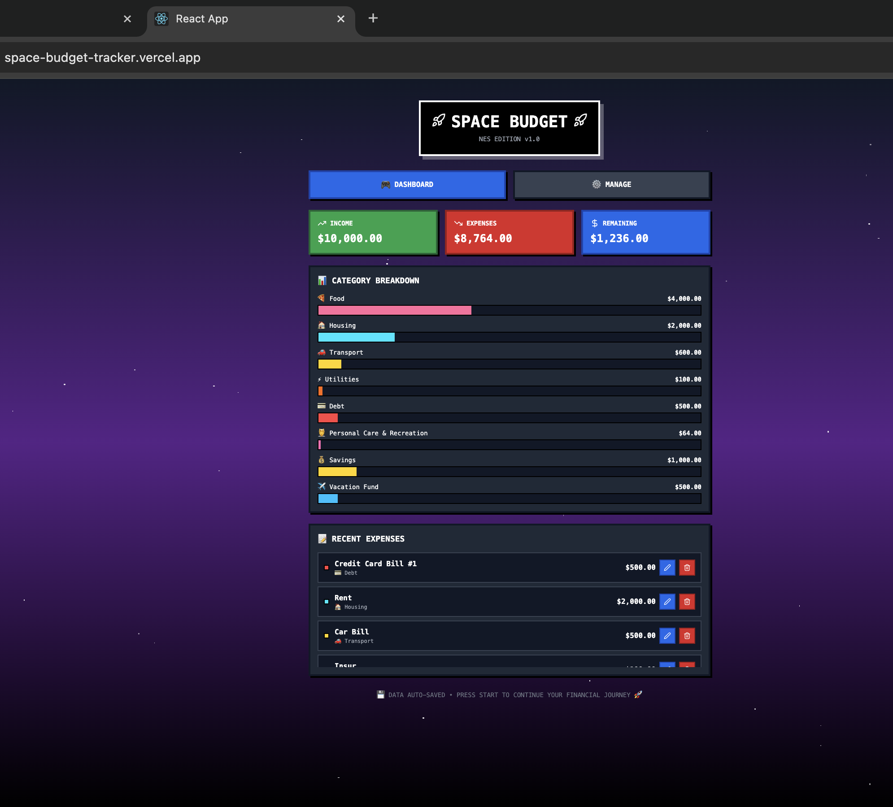

# 🚀 Space Budget Tracker - NES Edition

**[🌐 Live Demo](https://space-budget-tracker.vercel.app/)**

A retro NES/space-themed budget calculator built with React. Track income, expenses by category, and manage your budget with a nostalgic 8-bit aesthetic.



## ✨ Features

- 💰 **Income & Expense Tracking** - Manage your monthly budget
- 📊 **Category Breakdown** - Visualize spending across 10 categories
- ✏️ **Edit Expenses** - Modify transactions without deleting
- 💾 **Auto-Save** - Data persists with localStorage
- 📥 **CSV Export** - Download budget data for Excel/Sheets
- 🎮 **Retro UI** - NES-inspired design with pixel-perfect styling
- 🔊 **8-bit Sound Effects** - Retro audio feedback (Web Audio API)
- ⚡ **Fast & Responsive** - Smooth animations, mobile-friendly

## 🛠️ Technologies Used

- **React** - Component-based UI
- **Tailwind CSS** - Utility-first styling
- **Web Audio API** - Retro sound generation
- **LocalStorage** - Client-side data persistence
- **Lucide React** - Icon library

## 🚀 Quick Start

```bash
# Clone the repository
git clone [your-repo-url]

# Navigate to project
cd space-budget-tracker

# Install dependencies
npm install

# Start development server
npm start
```

Open http://localhost:3000 to view in browser.
